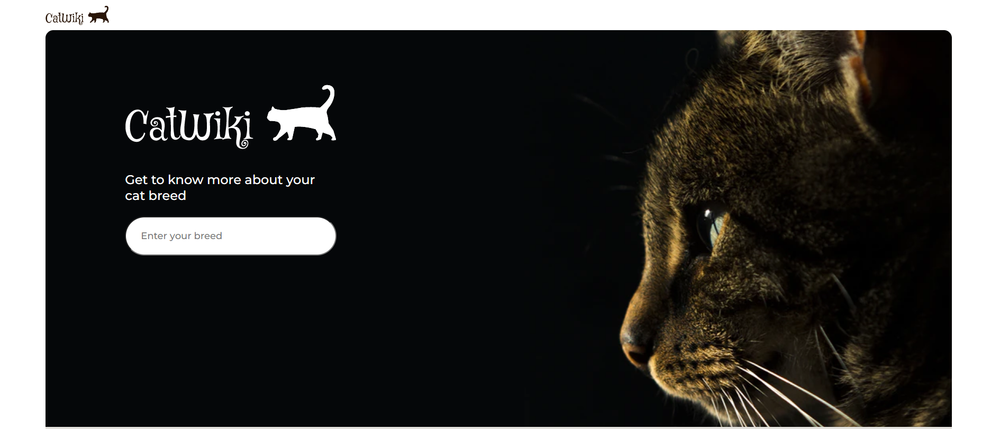

# Cat Wiki

# Api Repository

https://github.com/omercalik/cat-wiki-api

# Info

This is a cat wikia build by nextjs on frontend and nestjs on backend. I used MongoDB as database. You can search for cat breeds and check their details.
API hosted on Heroku so when you open the website it might be offline.

[Go to website](https://omercalik-catwiki.netlify.app/)

